# Synapse Motors

Synapse Motors is a school-based project developed for academic purposes. This system was created as part of a student project to demonstrate web application development concepts such as user management, authentication, and buyer/admin workflows in an automotive-themed platform.

## Purpose

This project is intended for school use and educational presentation. It serves as a sample application for learning, demonstration, and project evaluation.

**Link:** https://synapse-motors.onrender.com/

## Sample User Accounts

### Admin

Email: `synapsemotors@admin.com`<br>
Password: `pass`

### Buyer

Email: `synapsemotors@buyer.com`<br>
Password: `pass`

## System Overview

The system screenshots in the project documentation show two main user experiences:

- **Buyer-facing experience** - browsing vehicles, viewing vehicle details, managing a cart, checking out, and completing a simulated vehicle reservation.
- **Administrator experience** - viewing dashboard statistics, managing inventory, managing administrator access, sending invitations, and reviewing reports and the audit log.

The screenshots below are taken from the submitted Synapse Motors system screenshots documentation.

## Buyer Features

### Landing Page

The landing page serves as the main entry point for guests and buyers. It presents featured vehicles, promotional content, and quick navigation throughout the website.

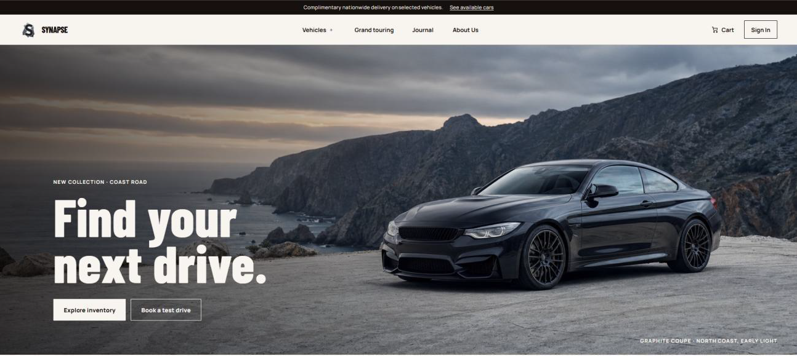

### Expanded Navigation and Vehicle Directory

The expanded navigation organizes vehicle categories and shopping options so users can browse cars based on their preferences.

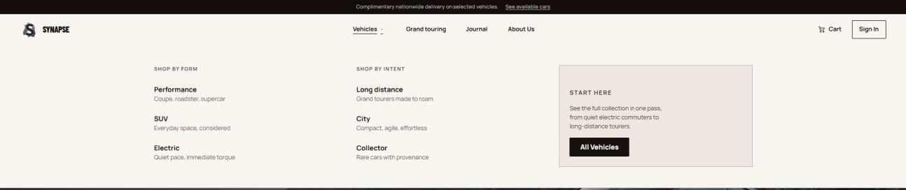

The Vehicle Directory displays the available vehicles and supports browsing, searching, category filtering, viewing vehicle details, and adding preferred vehicles to the shopping cart.

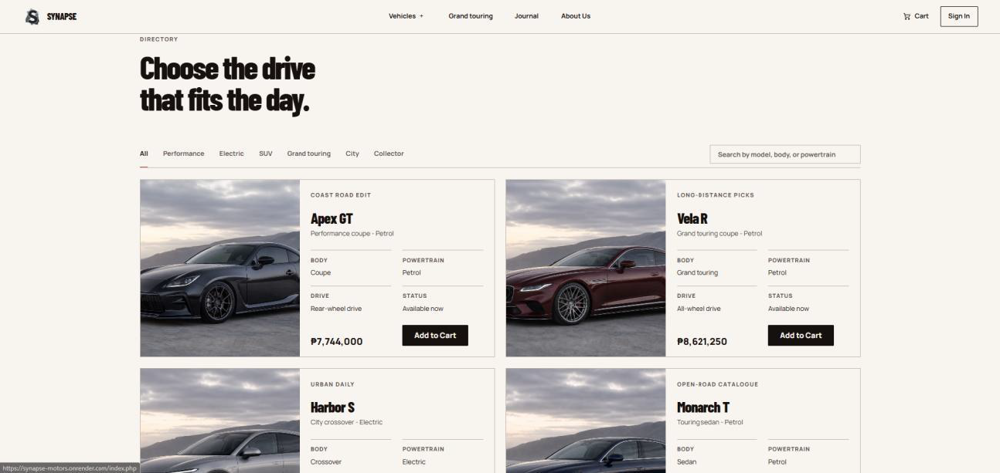

### Sign In and Sign Up

The authentication interface provides sign-in and sign-up forms. New users can register and verify their accounts before accessing buyer features.

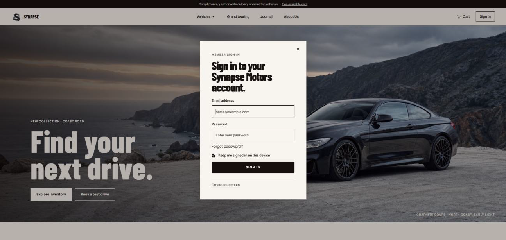

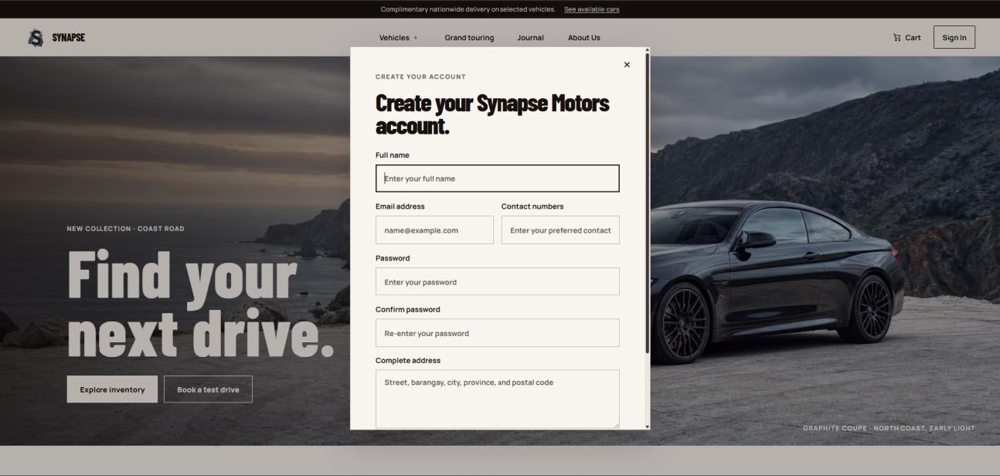

### Email Confirmation

After registration, the system sends an automated email that allows the user to verify their email address and activate the account before accessing the system.


### Cart and Checkout

The Cart page shows the vehicles selected by the buyer and provides controls to review items, remove vehicles, view the order summary, and proceed to checkout. Guest users do not have access to the cart page.

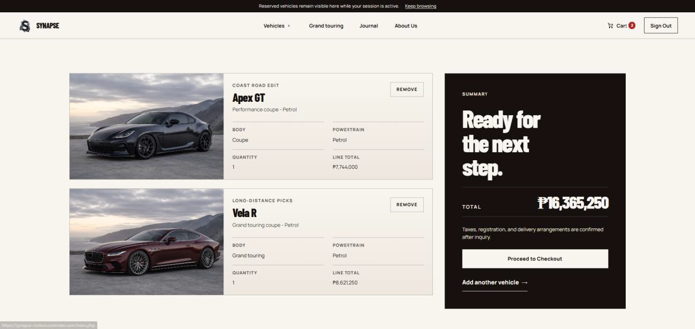

The Checkout page collects buyer contact information, reviews the selected vehicles, and confirms the order details before continuing to the payment step.

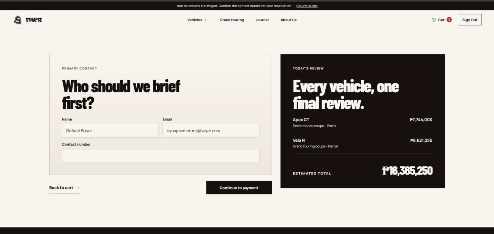

### Payment and Completed Order

The Payment page provides a simulated checkout process. Users can select a payment method, review the reservation summary, and confirm a vehicle reservation without using an actual payment gateway.

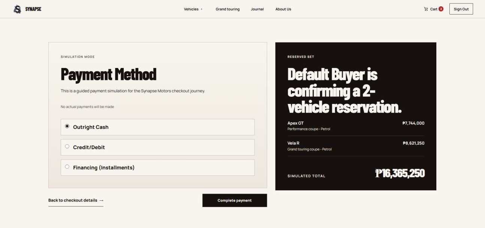

After confirmation, the Completed Order modal displays the reservation reference and summary and allows the user to continue browsing or close the confirmation dialog.

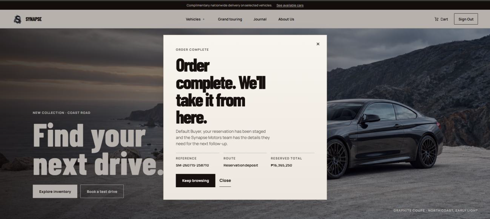

## Administrator Features

### Admin Dashboard and Inventory

The Admin Dashboard is the landing page for users with the Administrator role after a successful login. It provides an overview of the system, including inventory statistics, administrator accounts, recent activities, and quick access to inventory management and reports.

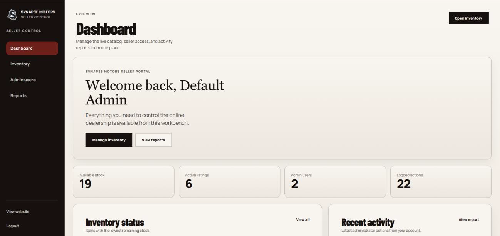

The Inventory page allows administrators to add, edit, or delete vehicle listings, update prices and stock levels, and monitor vehicle availability from a single interface.

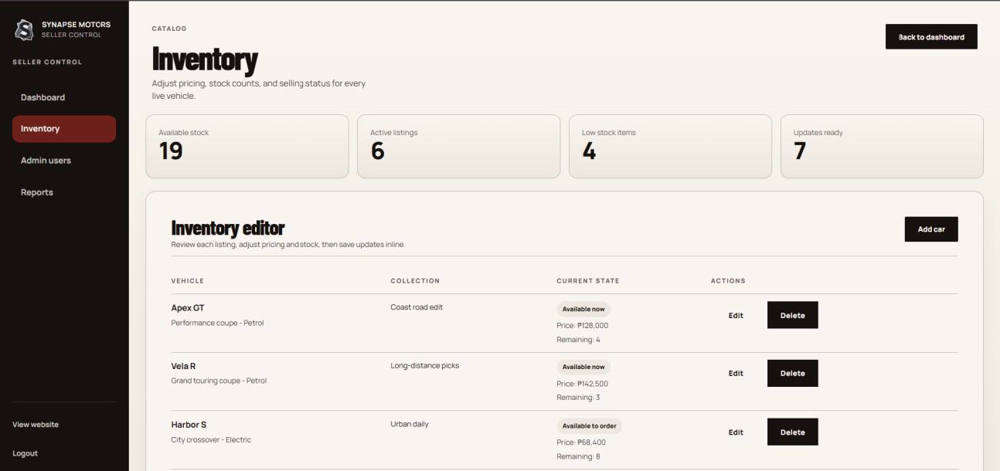

### Admin Users and Email Invitation

The Admin Users page enables administrators to manage seller accounts by inviting new administrators, monitoring email verification status, updating account information, and managing administrator access within the system.

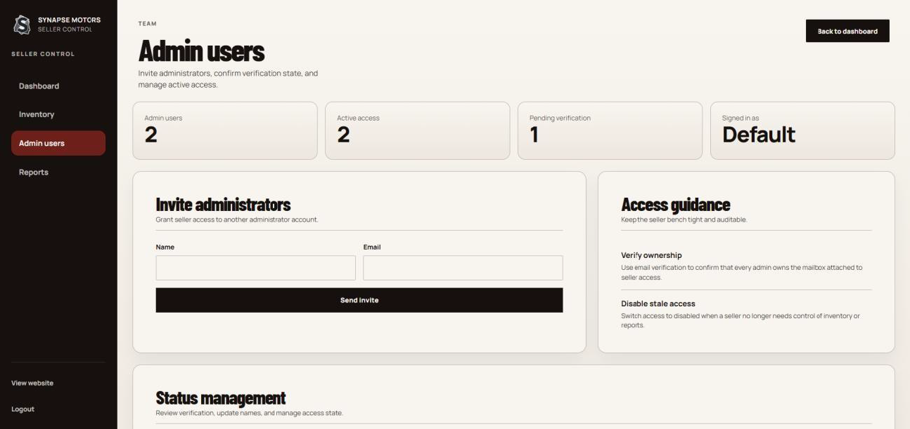

The email invitation workflow sends an invitation to the recipient, who can use the invited email address to register and activate the administrator account.


### Reports and Audit Log

The Reports page provides an overview of the current inventory status and a comprehensive audit log that records activities performed by administrator accounts within the system.

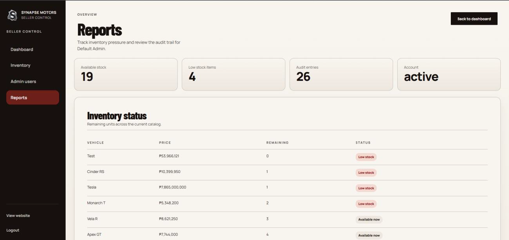

## Main Workflow

```text
Guest / Buyer
    |
    v
Landing Page
    |
    +--> Vehicle Directory --> Vehicle Selection --> Cart
    |                                      |
    |                                      v
    |                                  Checkout
    |                                      |
    |                                      v
    |                               Payment (Simulated)
    |                                      |
    |                                      v
    |                              Completed Order
    |
    +--> Sign In / Sign Up --> Email Confirmation --> Buyer Features

Administrator
    |
    v
Admin Dashboard
    |
    +--> Inventory Management
    +--> Admin Users / Invitations
    +--> Reports / Audit Log
```

## Documentation Notes

The system documentation presents the following major areas:

| Area | Functionality |
| --- | --- |
| Landing Page | Entry point, featured vehicles, promotional content, navigation |
| Vehicle Directory | Browse, search, filter, view details, add to cart |
| Authentication | Sign in, sign up, account verification |
| Email Confirmation | Activate registered user accounts |
| Cart | Review and manage selected vehicles |
| Checkout | Collect buyer details and confirm order information |
| Payment | Simulated payment/reservation process |
| Order Completion | Reservation confirmation and reference details |
| Admin Dashboard | System overview, statistics, recent activity, quick access |
| Inventory | Add, edit, delete vehicles, update price/stock, monitor availability |
| Admin Users | Manage administrator access and invitations |
| Reports | Inventory overview and administrator audit log |

## Academic Project

Synapse Motors is presented as a school-based project for demonstration, learning, and evaluation. The supplied documentation focuses on the application's user interface, buyer workflow, authentication flow, and administrator management features.
